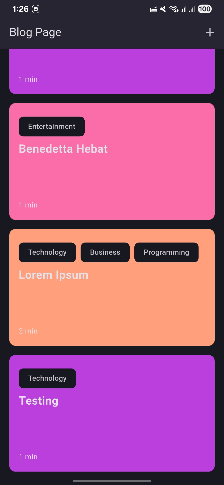
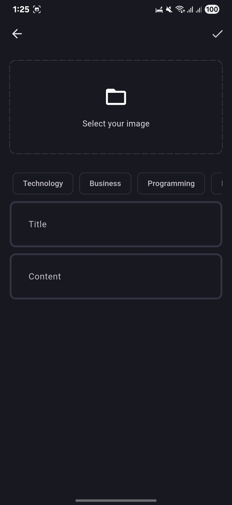

# blog_app

Just my learning by project from youtube

Im using bloc for state management, getit for dependencies injection, hive for local database, supabase for remote database, caching to hive

## 📱 Screenshots

### Home Page

### Add Note Page

### Note Page

